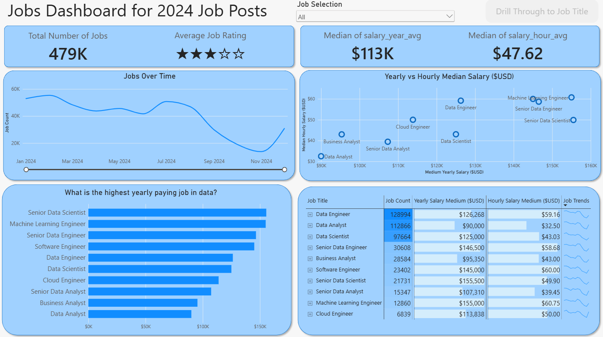
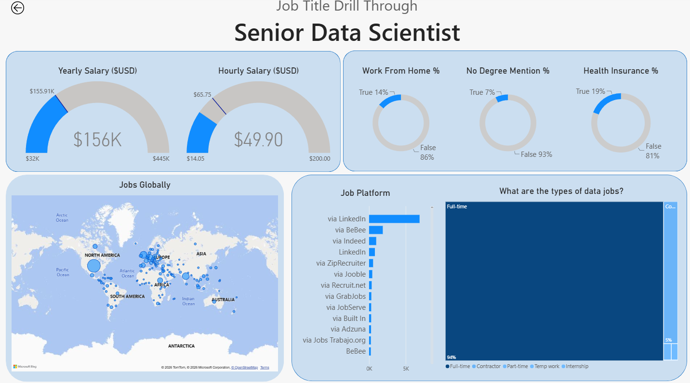
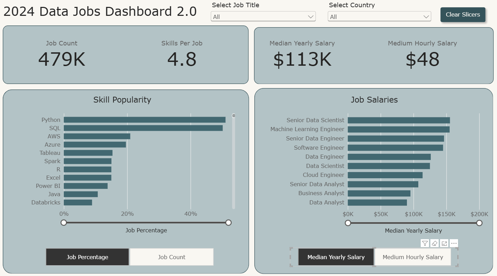

# Job Dashboard for 2024 Job Posts

Two interactive Power BI dashboards exploring data and IT-related job postings from 2024. The projects bring together job demand, skill popularity, salary comparisons, hiring locations, and employment conditions to help users explore the job market and investigate roles that interest them.

## Project Reference

This project was developed with reference to **Power BI for Data Analytics - Full Course for Beginners**, a YouTube video by **Luke Barousse**.

## Project 1 — Job Market Overview and Job Title Details

### Dashboard Overview

The report contains two interactive pages: an overview for comparing jobs and a drill-through page for exploring a selected job title.

#### Page 1 — Job Market Overview

The first page summarises the dataset and helps users compare roles and identify trends throughout 2024. It includes:

- **Total number of jobs:** the number of job postings in the current selection.
- **Average job rating:** a summary displayed using a star rating.
- **Yearly and hourly salaries:** median salary values in US dollars.
- **Jobs over time:** a line chart showing how posting volumes change during the year.
- **Yearly versus hourly pay:** a scatter plot comparing median annual and hourly salaries across job titles.
- **Salary rankings:** a bar chart comparing job titles by yearly pay.
- **Detailed job comparison:** a matrix combining posting counts, salary values, and trend sparklines.

The **Job Selection** dropdown allows users to select one or multiple roles to filter and compare on the overview page. Drill-through works with **one job title at a time**: click a single job in one of the visuals to activate the **Drill Through to Job Title** button.

#### Page 2 — Job Title Details

The second page provides a closer look at a selected job title. The screenshot below shows **Senior Data Scientist** as an example. This page includes:

- **Yearly and hourly salaries:** salary gauges summarising pay for the selected role in US dollars.
- **Work-from-home availability:** the proportion of postings marked as allowing remote work.
- **No degree mentioned:** the proportion of postings flagged as not mentioning a degree requirement.
- **Health insurance:** the proportion of postings marked as offering health insurance.
- **Global job distribution:** a map showing where postings for the selected role are located, with bubble sizes representing posting counts.
- **Job platforms:** a bar chart comparing the number of postings across recruitment platforms.
- **Employment types:** a treemap showing the proportions of full-time, contractor, part-time, temporary, and internship postings.

These details help users compare the opportunities, benefits, and employment arrangements associated with a role. A posting that does not mention a degree should not automatically be interpreted as confirming that no degree is required.

### Visualisations and Interactive Features

| Visual | Purpose |
| --- | --- |
| Cards and star rating | Summarise job counts, salaries, and job ratings |
| Line chart | Show changes in job-posting volume over time |
| Scatter plot | Compare yearly and hourly salaries across roles |
| Bar charts | Compare salary rankings and recruitment platforms |
| Matrix with sparklines | Present detailed job metrics alongside trends |
| Salary gauges | Display pay information for the selected role |
| Doughnut charts | Show the proportions of postings with selected benefits or requirements |
| Map | Show the geographic distribution of job postings |
| Treemap | Compare employment types by their share of postings |

The dashboard supports job-title filtering, interactive visual selections, and drill-through navigation. Users can move from the overview to a selected role's details using the drill-through button, then return using the back button.

### Video Demonstration

The recording demonstrates the dashboard and its interactive features.

[Watch or download the Project 1 dashboard demonstration](images/Project_1_recording.mp4)

### Explore the Project

1. Download [Project_1.pbix](Project_1.pbix) and open it in Power BI Desktop.
2. Explore the overview page and use **Job Selection** to filter for one or multiple roles. Multiple selections apply to the overview page, but drill-through works with **one job title at a time**. Click a single job in one of the visuals, such as its bar in the salary chart or its row in the matrix, to activate the **Drill Through to Job Title** button.
3. Use **Drill Through to Job Title** to open the detailed page for the selected role.
4. Explore the salary, benefits, location, platform, and employment-type visuals, then use the back button to return to the overview.

The screenshots and recording provide a preview; open the Power BI file to interact with the report. All figures describe the postings represented in this project's dataset and the active filter selection.

## Project 2 — Skill Popularity and Job Salaries

### Dashboard Overview

The second project explores the popularity of job-related skills and compares salaries across data and IT roles. The report contains one interactive page, bringing together key job-market metrics, skill demand, and salary rankings for the selected job title or country.

#### Page 1 — Skills and Salary Overview

The page helps users identify commonly requested skills and explore how pay varies across roles. It includes:

- **Job count:** the number of job postings in the current selection.
- **Skills per job:** the average number of skills required per job in the current selection.
- **Yearly and hourly salaries:** median salary values in US dollars.
- **Skill popularity:** a horizontal bar chart comparing skills such as Python, SQL, AWS, Azure, Tableau, and Power BI. Users can switch between **Job Percentage** and **Job Count** to explore skill demand as a proportion or a number of postings.
- **Job salaries:** a horizontal bar chart comparing pay across job titles. Users can switch between yearly and hourly salary views to explore salary rankings.

The **Select Job Title** and **Select Country** dropdowns filter the dashboard so users can explore a role, a country, or a combination of both. The **Clear Slicers** button resets these selections. The screenshot below shows the overview with both filters set to **All**.

### Visualisations and Interactive Features

| Visual | Purpose |
| --- | --- |
| KPI cards | Summarise job count, average skills per job, and median yearly and hourly salaries |
| Skill popularity bar chart | Compare skills by their share of job postings or posting count |
| Job salaries bar chart | Compare salary rankings across job titles |
| Job-title and country dropdowns | Filter the metrics and charts by role and location |
| Metric selection buttons | Switch between skill percentages and counts, or yearly and hourly salaries |
| Clear Slicers button | Reset the job-title and country selections |

These features help users investigate which skills are commonly requested and compare pay across roles within the selected job market, all on a single page.

### Video Demonstration

The recording demonstrates the dashboard and its interactive features.

[Watch or download the Project 2 dashboard demonstration](images/Project_2_recording.mp4)

### Explore the Project

1. Download [Project_2.pbix](Project_2.pbix) and open it in Power BI Desktop.
2. Use **Select Job Title** and **Select Country** to filter the dashboard by role and location.
3. Review the job count, skills per job, and salary cards for the current selection.
4. Switch between **Job Percentage** and **Job Count** to explore skill popularity, then compare job salaries using the yearly and hourly views.
5. Use **Clear Slicers** to reset the filters and return to the overall view.

The screenshot and recording provide a preview; open the Power BI file to interact with the report. All figures describe the postings represented in this project's dataset and the active filter selection.
